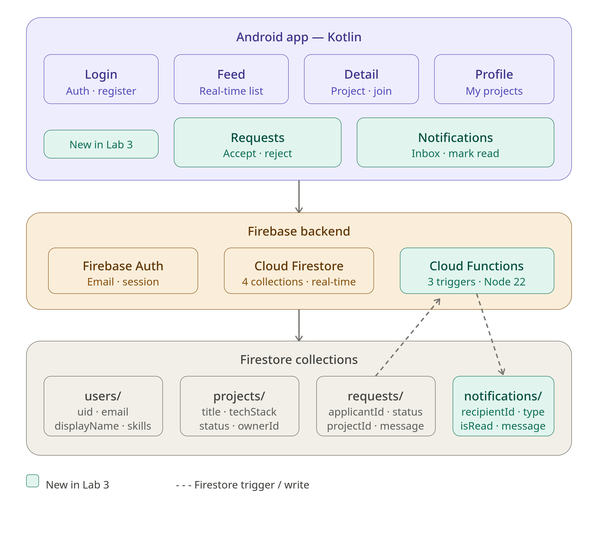

# CollabBoard 🚀


> Connecting university students to find project collaborators and co-founders.

**Developer:** Fabricio Farro  
**Roles:** Product Owner · Tech Lead · Developer · QA/DevOps

## Problem Statement

Students with great project ideas can't find the right technical collaborators 
at their university. CollabBoard solves this by creating a focused space where 
students post projects and others can apply to join.

## MVP Features

1. 🔐 Email authentication with Firebase Auth
2. 📋 Browse projects feed in real time  
3. ➕ Post your own project with tech stack needed
4. 🔍 View project details and send join request
5. 👤 Personal profile with your posted projects

## Architecture




## Firestore Data Model

**users/** — uid, displayName, email, university, skills, createdAt  
**projects/** — projectId, ownerId, ownerName, title, description, techStack, status, createdAt  
**requests/** — requestId, projectId, applicantId, applicantName, message, status, createdAt


## Tech Stack

`Kotlin` `Firebase Auth` `Firestore` `Navigation Component` `RecyclerView` `GitHub Actions`

## Run Tests

```bash
./gradlew test
```

## Setup

1. Clone repo
2. Add `google-services.json` to `/app`
3. Enable Firebase Auth (Email/Password) and Firestore in test mode
4. Run in Android Studio API 24+

## Sprint Board

[CollabBoard Trello Board](https://trello.com/b/0iLxE3VL)

